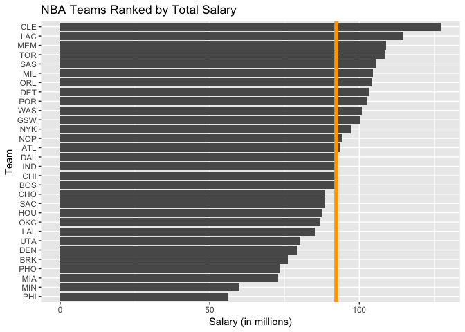
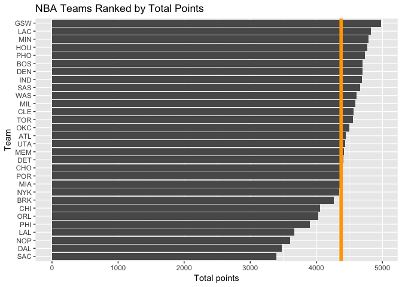
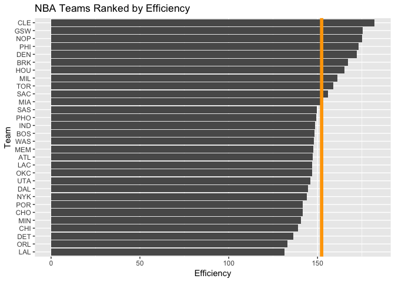
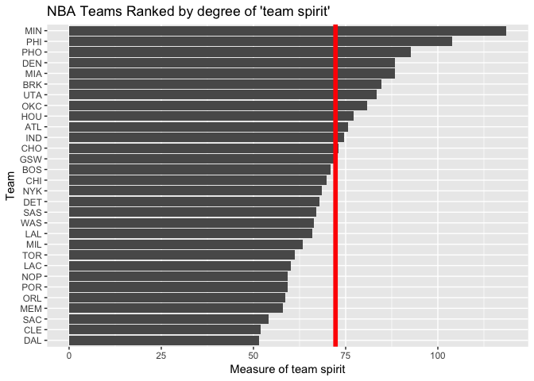

Project1\_Stat133
================

Workout 1 - Data Wrangling and Visualization
============================================

Ranking part
============

``` r
dataset_ranking <- read.csv("../data/nba2018-teams.csv", header=TRUE)
dataset_ranking
```

    ##     X team experience_total total_salary points_3 points_2 points_1
    ## 1   1  ATL              172     93.40559      660     2337     1453
    ## 2   2  BOS              183     91.91509      985     2183     1536
    ## 3   3  BRK              245     76.21567      777     2040     1444
    ## 4   4  CHI              144     92.50189      565     2162     1330
    ## 5   5  CHO              174     88.50477      808     2089     1497
    ## 6   6  CLE              146    127.25458     1030     2148     1384
    ## 7   7  DAL              237     92.82830      712     1754     1007
    ## 8   8  DEN              214     79.02822      868     2351     1477
    ## 9   9  DET              166    103.07449      631     2638     1140
    ## 10 10  GSW              166    100.24256      982     2545     1455
    ## 11 11  HOU              157     87.39233     1140     2011     1623
    ## 12 12  IND              171     92.62084      709     2512     1467
    ## 13 13  LAC              177    114.77662      841     2401     1586
    ## 14 14  LAL              178     85.12544      582     2069     1021
    ## 15 15  MEM              214    108.94584      757     2176     1489
    ## 16 16  MIA              165     72.94438      799     2349     1217
    ## 17 17  MIL              232    104.64657      720     2462     1413
    ## 18 18  MIN              157     59.87827      599     2607     1580
    ## 19 19  NOP              225     94.03548      519     1956     1128
    ## 20 20  NYK              228     97.10692      636     2445     1262
    ## 21 21  OKC              194     86.98136      611     2380     1511
    ## 22 22  ORL              236    104.11034      618     2178     1232
    ## 23 23  PHI              206     56.29336      718     1960     1225
    ## 24 24  PHO              188     73.28258      569     2554     1615
    ## 25 25  POR              161    102.48876      847     2148     1386
    ## 26 26  SAC              235     88.27720      562     1838      998
    ## 27 27  SAS              189    105.39553      753     2469     1440
    ## 28 28  TOR              187    108.45847      626     2359     1570
    ## 29 29  UTA              155     80.32319      791     2242     1401
    ## 30 30  WAS              204    100.78591      718     2526     1368
    ##    total_points total_off_rebounds total_def_rebounds total_assists
    ## 1          4450                832               2676          1846
    ## 2          4704                744               2698          2069
    ## 3          4261                689               2697          1664
    ## 4          4057                865               2419          1746
    ## 5          4394                621               2615          1806
    ## 6          4562                735               2673          1779
    ## 7          3473                521               2063          1183
    ## 8          4696                872               2660          2015
    ## 9          4409                908               2838          1732
    ## 10         4982                770               2869          2486
    ## 11         4774                857               2608          1969
    ## 12         4688                742               2702          1844
    ## 13         4828                738               2790          1848
    ## 14         3672                789               2213          1334
    ## 15         4422                880               2582          1725
    ## 16         4365                856               2648          1728
    ## 17         4595                723               2589          1984
    ## 18         4786                932               2516          1924
    ## 19         3603                580               2248          1531
    ## 20         4343                962               2592          1499
    ## 21         4502                936               2628          1610
    ## 22         4028                707               2452          1760
    ## 23         3903                690               2354          1816
    ## 24         4738                882               2464          1531
    ## 25         4381                706               2428          1508
    ## 26         3398                525               1876          1402
    ## 27         4662                821               2777          1954
    ## 28         4555                847               2535          1469
    ## 29         4434                771               2774          1651
    ## 30         4612                806               2564          1893
    ##    total_steals total_blocks total_turnovers total_fouls total_efficiency
    ## 1           645          381            1201        1432         147.2123
    ## 2           617          340            1037        1686         148.2395
    ## 3           568          382            1212        1620         167.0333
    ## 4           605          339             956        1275         139.0978
    ## 5           543          316             820        1177         141.5019
    ## 6           483          304            1020        1356         182.0806
    ## 7           507          257             674        1229         144.6322
    ## 8           543          286            1102        1475         172.2445
    ## 9           574          310             932        1467         136.4089
    ## 10          782          554            1179        1581         175.3384
    ## 11          617          331            1113        1473         165.2848
    ## 12          669          409            1087        1597         148.7141
    ## 13          612          347            1022        1626         147.0737
    ## 14          510          267             972        1444         131.4561
    ## 15          629          335             993        1798         147.5533
    ## 16          579          464            1019        1647         152.1863
    ## 17          666          436            1096        1660         161.2450
    ## 18          641          368            1085        1620         140.7781
    ## 19          502          380             828        1168         175.1662
    ## 20          526          451             975        1584         143.9152
    ## 21          595          395            1133        1561         146.9182
    ## 22          546          305             987        1445         133.1438
    ## 23          613          375            1197        1573         172.9546
    ## 24          588          385            1171        1887         149.2347
    ## 25          522          342             978        1581         141.7957
    ## 26          506          232             850        1303         155.8247
    ## 27          655          484            1057        1498         149.7043
    ## 28          620          379             932        1609         158.7556
    ## 29          550          410            1060        1545         145.8056
    ## 30          655          325            1062        1643         147.8051

``` r
# Bar chart of the Total salary
ggplot(dataset_ranking, aes(x=reorder(dataset_ranking$team, dataset_ranking$total_salary), y=dataset_ranking$total_salary)) + #
  geom_bar(stat='identity') +
  coord_flip() + ggtitle("NBA Teams Ranked by Total Salary") + labs(x = "Team") + labs(y = "Salary (in millions)") + geom_hline(yintercept=mean(dataset_ranking$total_salary), color= 'orange', size=2)
```



``` r
# Bar chart of the Total points
ggplot(dataset_ranking, aes(x=reorder(dataset_ranking$team, dataset_ranking$total_points), y=dataset_ranking$total_points)) + 
  geom_bar(stat='identity') +
  coord_flip() + ggtitle("NBA Teams Ranked by Total Points") + labs(x = "Team") + labs(y = "Total points") + geom_hline(yintercept=mean(dataset_ranking$total_points), color= 'orange', size=2)
```



``` r
#Bar chart of the total efficiency
ggplot(dataset_ranking, aes(x=reorder(dataset_ranking$team, dataset_ranking$total_efficiency), y=dataset_ranking$total_efficiency)) + 
  geom_bar(stat='identity') +
  coord_flip() + ggtitle("NBA Teams Ranked by Efficiency") + labs(x = "Team") + labs(y = "Efficiency") + geom_hline(yintercept=mean(dataset_ranking$total_efficiency), color= 'orange', size=2)
```



``` r
#We create our own index of performance of team.

#We will now create another index for teams. The purpose of this index will be to approach the future potential of a given team in the NBA competition. One may indeed think that a team with a potential is a team with a strong team spirit and advantages based on the collective rather than on individualities that may have to leave in another teams if important transfer offers are made or may be suddenly injured. Hence, in this index we will emphasize the collective statistics such as the points that result from collective actions, points1 and points2, the rebounds, the turnovers also and we will remove the fouls and normalize by the salaries.


dataset_index <- mutate(dataset_ranking, degrees_colec = (total_points - points_3 + total_off_rebounds + total_def_rebounds + total_turnovers - total_fouls)/ (total_salary))
dataset_index 
```

    ##     X team experience_total total_salary points_3 points_2 points_1
    ## 1   1  ATL              172     93.40559      660     2337     1453
    ## 2   2  BOS              183     91.91509      985     2183     1536
    ## 3   3  BRK              245     76.21567      777     2040     1444
    ## 4   4  CHI              144     92.50189      565     2162     1330
    ## 5   5  CHO              174     88.50477      808     2089     1497
    ## 6   6  CLE              146    127.25458     1030     2148     1384
    ## 7   7  DAL              237     92.82830      712     1754     1007
    ## 8   8  DEN              214     79.02822      868     2351     1477
    ## 9   9  DET              166    103.07449      631     2638     1140
    ## 10 10  GSW              166    100.24256      982     2545     1455
    ## 11 11  HOU              157     87.39233     1140     2011     1623
    ## 12 12  IND              171     92.62084      709     2512     1467
    ## 13 13  LAC              177    114.77662      841     2401     1586
    ## 14 14  LAL              178     85.12544      582     2069     1021
    ## 15 15  MEM              214    108.94584      757     2176     1489
    ## 16 16  MIA              165     72.94438      799     2349     1217
    ## 17 17  MIL              232    104.64657      720     2462     1413
    ## 18 18  MIN              157     59.87827      599     2607     1580
    ## 19 19  NOP              225     94.03548      519     1956     1128
    ## 20 20  NYK              228     97.10692      636     2445     1262
    ## 21 21  OKC              194     86.98136      611     2380     1511
    ## 22 22  ORL              236    104.11034      618     2178     1232
    ## 23 23  PHI              206     56.29336      718     1960     1225
    ## 24 24  PHO              188     73.28258      569     2554     1615
    ## 25 25  POR              161    102.48876      847     2148     1386
    ## 26 26  SAC              235     88.27720      562     1838      998
    ## 27 27  SAS              189    105.39553      753     2469     1440
    ## 28 28  TOR              187    108.45847      626     2359     1570
    ## 29 29  UTA              155     80.32319      791     2242     1401
    ## 30 30  WAS              204    100.78591      718     2526     1368
    ##    total_points total_off_rebounds total_def_rebounds total_assists
    ## 1          4450                832               2676          1846
    ## 2          4704                744               2698          2069
    ## 3          4261                689               2697          1664
    ## 4          4057                865               2419          1746
    ## 5          4394                621               2615          1806
    ## 6          4562                735               2673          1779
    ## 7          3473                521               2063          1183
    ## 8          4696                872               2660          2015
    ## 9          4409                908               2838          1732
    ## 10         4982                770               2869          2486
    ## 11         4774                857               2608          1969
    ## 12         4688                742               2702          1844
    ## 13         4828                738               2790          1848
    ## 14         3672                789               2213          1334
    ## 15         4422                880               2582          1725
    ## 16         4365                856               2648          1728
    ## 17         4595                723               2589          1984
    ## 18         4786                932               2516          1924
    ## 19         3603                580               2248          1531
    ## 20         4343                962               2592          1499
    ## 21         4502                936               2628          1610
    ## 22         4028                707               2452          1760
    ## 23         3903                690               2354          1816
    ## 24         4738                882               2464          1531
    ## 25         4381                706               2428          1508
    ## 26         3398                525               1876          1402
    ## 27         4662                821               2777          1954
    ## 28         4555                847               2535          1469
    ## 29         4434                771               2774          1651
    ## 30         4612                806               2564          1893
    ##    total_steals total_blocks total_turnovers total_fouls total_efficiency
    ## 1           645          381            1201        1432         147.2123
    ## 2           617          340            1037        1686         148.2395
    ## 3           568          382            1212        1620         167.0333
    ## 4           605          339             956        1275         139.0978
    ## 5           543          316             820        1177         141.5019
    ## 6           483          304            1020        1356         182.0806
    ## 7           507          257             674        1229         144.6322
    ## 8           543          286            1102        1475         172.2445
    ## 9           574          310             932        1467         136.4089
    ## 10          782          554            1179        1581         175.3384
    ## 11          617          331            1113        1473         165.2848
    ## 12          669          409            1087        1597         148.7141
    ## 13          612          347            1022        1626         147.0737
    ## 14          510          267             972        1444         131.4561
    ## 15          629          335             993        1798         147.5533
    ## 16          579          464            1019        1647         152.1863
    ## 17          666          436            1096        1660         161.2450
    ## 18          641          368            1085        1620         140.7781
    ## 19          502          380             828        1168         175.1662
    ## 20          526          451             975        1584         143.9152
    ## 21          595          395            1133        1561         146.9182
    ## 22          546          305             987        1445         133.1438
    ## 23          613          375            1197        1573         172.9546
    ## 24          588          385            1171        1887         149.2347
    ## 25          522          342             978        1581         141.7957
    ## 26          506          232             850        1303         155.8247
    ## 27          655          484            1057        1498         149.7043
    ## 28          620          379             932        1609         158.7556
    ## 29          550          410            1060        1545         145.8056
    ## 30          655          325            1062        1643         147.8051
    ##    degrees_colec
    ## 1       75.65928
    ## 2       70.84800
    ## 3       84.78571
    ## 4       69.80398
    ## 5       73.04691
    ## 6       51.89597
    ## 7       51.60064
    ## 8       88.41145
    ## 9       67.80533
    ## 10      72.19488
    ## 11      77.11203
    ## 12      74.63763
    ## 13      60.21261
    ## 14      66.02022
    ## 15      58.02883
    ## 16      88.31387
    ## 17      63.28922
    ## 18     118.57389
    ## 19      59.25423
    ## 20      68.50181
    ## 21      80.78742
    ## 22      58.69734
    ## 23     103.97319
    ## 24      92.77785
    ## 25      59.17722
    ## 26      54.19293
    ## 27      67.04269
    ## 28      61.16627
    ## 29      83.45037
    ## 30      66.30887

``` r
ggplot(dataset_index, aes(x=reorder(dataset_index$team, dataset_index$degrees_colec), y=dataset_index$degrees_colec)) + 
  geom_bar(stat='identity') +
  coord_flip() + ggtitle("NBA Teams Ranked by degree of 'team spirit'") + labs(x = "Team") + labs(y = "Measure of team spirit") + geom_hline(yintercept=mean(dataset_index$degrees_colec), color= 'red', size=2)
```


